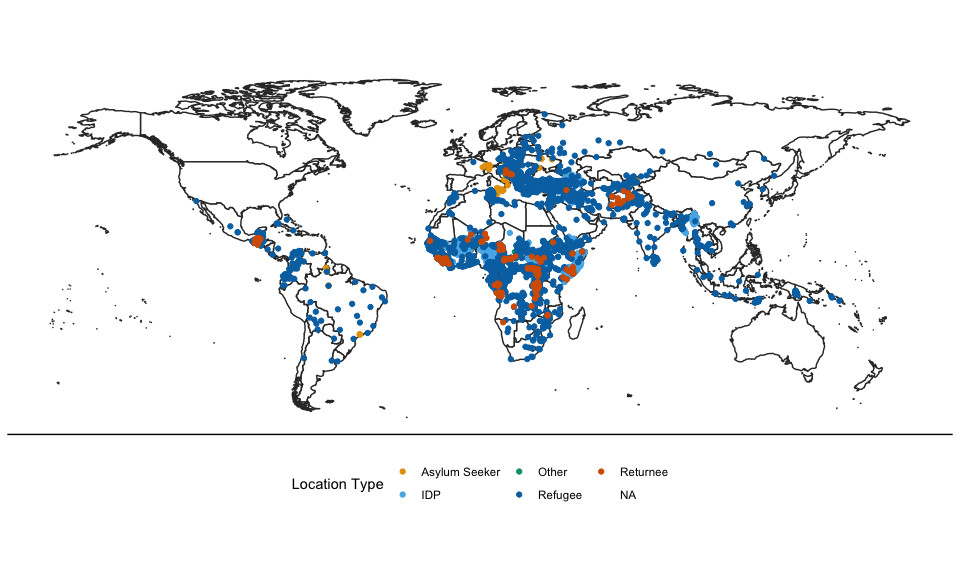

Dataset of Displacement Locations (UNHCR)
=========================================

This repository contains the data of displacement (IDP, refugee,
returnee) locations as featured in:

Zhou, Yang-Yang and Andrew Shaver. (2021). [Reexamining the Effect of
Refugees on Civil Conflict: A Global Subnational
Analysis.](https://doi.org/10.1017/S0003055421000502) American Political
Science Review, 1-22.
<a href="doi:10.1017/S0003055421000502" class="uri">doi:10.1017/S0003055421000502</a>

Overview
--------

**displacement_locations_unhcr.csv** is a global dataset from the UNHCR
Field Information and Coordination Support Section (FICSS). This dataset
encompasses the universe of refugee, returnee, IDP, and asylum seeker
locations that the UNHCR is aware of (even if they are not actively
working in these locations), and it includes historic and currently open
sites. The earliest recorded locations are from 1966, and the data was
last updated by FICSS on January 6, 2020.

To construct these data, UNHCR country teams and field staff report the
location of any known displaced communities to FICSS.

With the help of a team of research assistants, we manually validated
and corrected refugee and IDP locations that were open during our study
period from 1990–2018. Outside of this time span, we have not made
corrections.

Thus, we share this dataset on Github not only to provide researchers
with global data on historic and current displacement locations, but
also to make this a “living dataset,” where experts can send us
corrections and where the most updated version is always publicly
available.

Descriptives
------------

**displacement_locations_unhcr.csv** has 13733 observations.

The table and map below show the displacement locations by migration
type and whether they are open or closed as of late 2019/early 2020.

| Type          |    N | Closed | Open |
|:--------------|-----:|-------:|-----:|
| Asylum Seeker |   97 |     27 |   70 |
| IDP           | 5840 |   1798 | 4042 |
| Other         |  165 |    165 |    0 |
| Refugee       | 7341 |   3632 | 3709 |
| Returnee      |  261 |    223 |   38 |

Number of locations by type

Codebook
--------

Submit a correction to the data
-------------------------------

Acknowledgements
----------------

We are indebted to experts from the United Nations High Commissioner for
Refugees (UNHCR): Jason Hepps, Ewen Macleod, Raouf Mazou, Brett Moore,
Petra Nahmias, Htun Zaw Oo, Yvon Orand, Kimberly Roberson, Karl
Steinacker, Tayyar Sukru Cansizoglu, Vicky Tennant, Alex Tyler, and
staff members of the Field Information and Coordination Section (FICSS)
for providing data and guidance.
