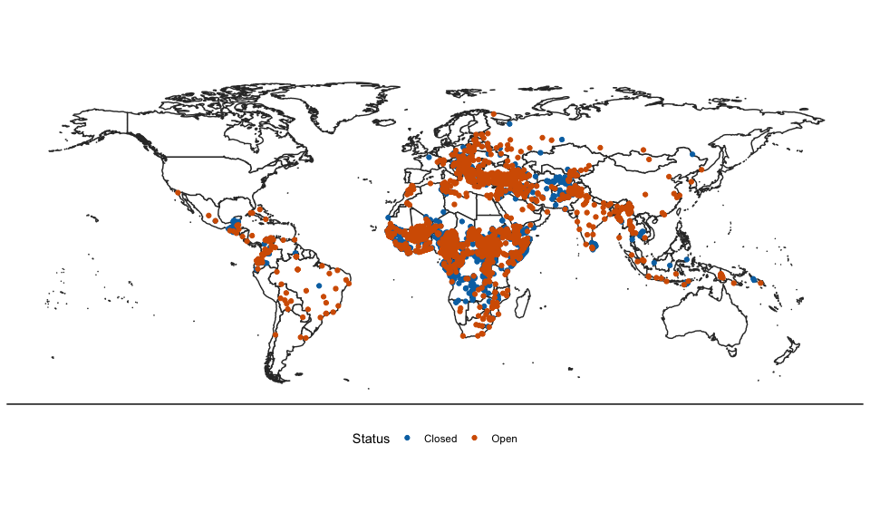

Dataset of Displacement Locations (UNHCR)
=========================================

This repository contains the data of displacement (IDP, refugee,
returnee, asylum seeker) locations as featured in:

Zhou, Yang-Yang and Andrew Shaver. (2021). [Reexamining the Effect of
Refugees on Civil Conflict: A Global Subnational
Analysis.](https://doi.org/10.1017/S0003055421000502) American Political
Science Review, 1-22.
<a href="doi:10.1017/S0003055421000502" class="uri">doi:10.1017/S0003055421000502</a>

If using this dataset, please cite this paper and acknowledge the UNHCR
Field Information and Coordination Support Section (FICSS).

Overview
--------

**displacement_locations_unhcr.csv** is a global dataset from the UNHCR
Field Information and Coordination Support Section (FICSS). This dataset
encompasses the universe of refugee, returnee, IDP, and asylum seeker
locations that the UNHCR is aware of (even if they are not actively
working in these locations), and it includes historic and currently open
sites. The earliest recorded locations are from 1966, and the data was
last updated by FICSS on January 6, 2020.

To construct these data, UNHCR country teams and field staff report the
location of any known displaced communities to FICSS.

With the help of a team of research assistants, we manually validated
and corrected refugee and IDP locations that were open during our study
period from 1990–2018. Outside of this time span, we have not made
corrections.

Thus, we share this dataset on Github not only to provide researchers
with global data on historic and current displacement locations, but
also to make this a “living dataset,” where experts can send us
corrections and where the most updated version is always publicly
available.

Descriptives
------------

**displacement_locations_unhcr.csv** has 13733 observations.

The table and map below show the displacement locations by migration
type and whether they are open or closed as of late 2019/early 2020.

| Type          |    N | Closed | Open |
|:--------------|-----:|-------:|-----:|
| Asylum Seeker |   97 |     27 |   70 |
| IDP           | 5840 |   1798 | 4042 |
| Other         |  165 |    165 |    0 |
| Refugee       | 7341 |   3632 | 3709 |
| Returnee      |  261 |    223 |   38 |

Number of locations by type

Codebook
--------

-   *pcode*: location ID
-   *Country*: country of the location
-   *name*: name of the location
-   *name_alt*: alternative name of the location if one exists
-   *loc_type*: type of location – Asylum Seeker Accommodation, Asylum
    Seeker Centre, Asylum Seeker Location, Asylum Seeker Settlement, IDP
    Accommodation, IDP Camp, IDP Center, IDP Dispersed, IDP Location,
    IDP Settlement, IDP Urban location, Refugee Accommodation, Refugee
    Camp, Refugee Center, Refugee Dispersed, Refugee Location, Refugee
    Settlement, Refugee Urban location, Returnee Accommodation, Returnee
    Camp, Returnee Center, Returnee Location, Returnee Settlement,
    Unknown. Most types are self explanatory, but according to our
    discussions with UNHCR staff, whether a location is designed as a
    “camp” and “settlement” is generally due to host country government
    preferences.
-   *loc_subtype*: some locations have additional designation types –
    Aliens Police Detention Facility, Asylum Integration Center (only
    for recognized refugees), Border Guard/Police Detention Facility,
    CHT (Centres d’Hebergement Temporaire / temporary reception centre),
    Home for Separated Children Seeking Asylum, Open reception facility
    for asylum-seekers, Open Shelters for Persons Authorized to Stay
    (Subsidiary form of protection).
-   *createdate*: date the location was created. Many dates are
    1/1/Year, which suggest the exact date is unknown but it was within
    that year.
-   *closedate*: if the location is closed, the date of closure
-   *updatedate*: when this data entry was updated, typically by UNHCR
    FICSS staff
-   *source*: source of the data
-   *unhcr_assist*: whether UNHCR has provided assistance to the
    location
-   *status*: 0 if closed, 1 if open as of the updatedate
-   *POINT_X*: longitude
-   *POINT_Y*: latitude
-   *adjusted_vars*: if anyone has made additional adjustments to the
    data from the UNHCR. E.g. observations that we (Zhou and Shaver)
    have made changes to.
-   *type*: Asylum seeker, IDP, Returnee, Refugee, or Other

Submit a correction to the data
-------------------------------

If you would like to submit a correction to the data, go to Issues \>
New Issue \> Data Entry and submit a report to help us improve the
dataset. Please make sure to send us a source (e.g. a report from the
UNHCR, IOM, etc.) so that we can validate the correction and for
transparency.

Coming Soon
-----------

We will continue to publicly release related data when they are ready.
Here’s what we’re working on now:

1.  **Refugee Location-Year Population data**: for each refugee location
    (eg. refugee camp, settlement), this dataset will also include total
    population by year along with population disaggregated by gender and
    origin country.

2.  **Uganda refugee settlement shapefiles and population data**: for
    Uganda, shapefiles of refugee settlements over time, along with
    their total population figures for election years, along with
    population disaggregated by origin country.

Acknowledgements
----------------

We are indebted to experts from the United Nations High Commissioner for
Refugees (UNHCR): Jason Hepps, Ewen Macleod, Raouf Mazou, Brett Moore,
Petra Nahmias, Htun Zaw Oo, Yvon Orand, Kimberly Roberson, Edgar Scrase,
Karl Steinacker, Tayyar Sukru Cansizoglu, Vicky Tennant, Alex Tyler, and
staff members of the Field Information and Coordination Support Section
(FICSS) for providing data and guidance.
